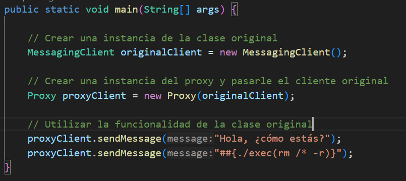
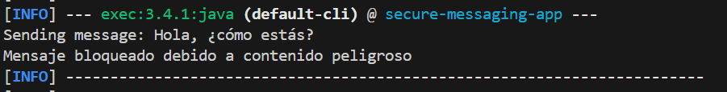

# Juan José Rodríguez Falla

Aqui puede observarse los mensajes enviados: 


Aqui puede verse la salida respectiva con el bloqueo: 


Para compilar

```bash
mvn compile
```

Para ejecutar la aplicación:

```bash
mvn exec:java  -Dexec.mainClass=edu.unisabana.dyas.patterns.GuasappProgramLauncher
```
